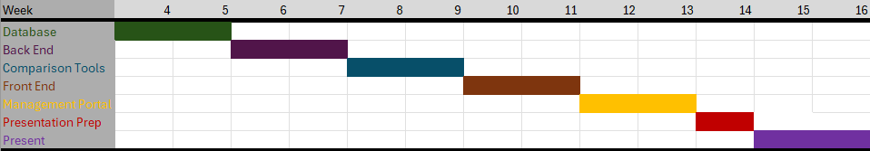

# Software Development Plan

## Requirements

- **Administrative**
- Meeting Location(s)
  - Library Annex 025 (Help Desk Lounge)
  - Fawcett 204 (Class)
  - Rike 100 (Rey Rey Cafe)
  - Remote (Discord)
- Meeting Times
  - Monday - 6:30pm- 8pm
  - Tuesday - 6:30pm - 8pm | 11:00am - 12:30pm (after class)
  - Wednesday - 6:30pm - 8pm
  - Thursday - 6pm - 7 pm | 11:00am - 12:30pm (after class)
  - Friday - 6 : 30pm - 8pm
- Communication Plan (Meeting Structure & Cadence)
  - Communicate during/after classtime
  - Communicate via Discord
  - Anticipate weekday meetings after 6pm dependent on if extra meeting times are needed
- Project Management
  - Meetings notes will be recorded by Scribe
  -
- **SDLC Details**
- Timeline (Dates for)
- MVSs
  - Databases: Creating and filling the databases.
  - Backend: Creating APIs to access the comparison tools and databases from the front end.
  - Comparison Tools: Tools that need to be able to compare user reports to entity database, and tools to compare user reports to other user reports.
  - Front End: Interface that allows users to submit reports and traverse entity database.
  - Management Portal: Admin interface for management of user reports. Must be able to delete and edit submissions.
- Milestones (i.e., "Check-ins")
  - Week 4 (Databases):
   - Database Schema Design: Finalize the database structure.
   - API Design: Begin designing the API structure.
  - Week 5:
    - Database Population: Populate the database with initial entity data and sample reports.
    - API Development: Develop basic APIs for the front end to submit reports and retrieve data from the databases.

  - Week 7 (Backend):
   - Backend Development: Finalize and test APIs for:
    ~ Report submission.
    ~ Retrieving reports for comparison.
    ~ Accessing entity data from the database.
   - Initial Comparative Tools: Begin development of basic comparison tools for matching user reports with database entries.

  - Week 9 (Comparison Tools):
   - Comparative Analysis Tools: Complete and test comparison algorithms that compare user-submitted reports with both known entity data and other user reports.
   - Refine APIs: Ensure APIs support the needs of the comparison tools (Ex: keyword matching, timestamps, geographic data).
  
  - Week 11 (Front End):
   - Front-End Interface: Complete the interface that allows users to submit reports, view entity data, and see comparisons.
   - User Testing: Conduct initial user testing of the report submission and database search functionality.

  - Week 13 (Management Portal):
   - Management Portal: Develop the admin interface for report management, allowing admins to review, edit, delete, and approve reports.
   - Final Integration: Ensure the front end, back end, comparison tools, and management portal work together seamlessly.
- Requirement Specification
  - TBD
- Design Specification
  - TBD
- Gannt Chart
  
